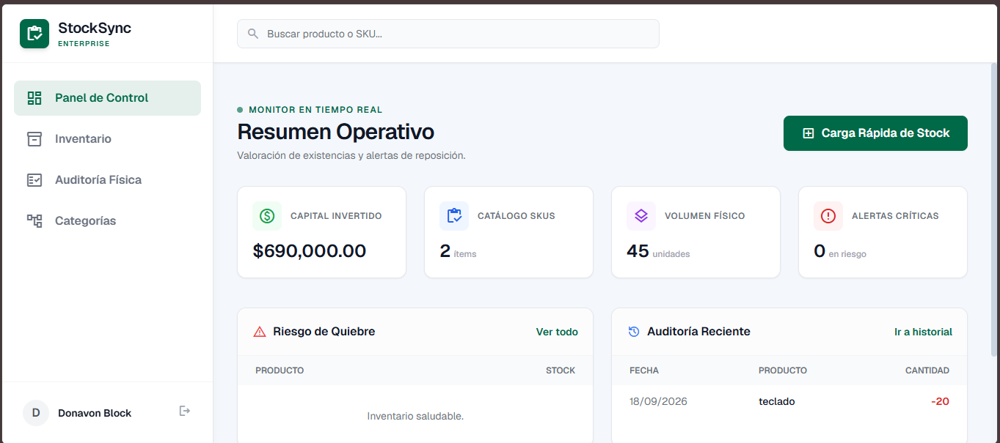

🇺🇸 [Read in English](#english-version) | 🇪🇸 [Leer en Español](#spanish-version)

---

# 🇪🇸 Versión en Español

**StockSync Enterprise** es un sistema de planificación de recursos (ERP) y gestión de inventarios diseñado para operaciones logísticas, control de bodegas y auditoría física de stock. 

## 🚀 Características Principales
*   **Motor de Sincronización Excel:** Importación/exportación bidireccional (`.xlsx`, `.xls`, `.csv`) con validación automática y prevención de duplicidad (Upsert).
*   **Auditoría Física:** Trazabilidad de entradas, salidas y mermas con registro de usuario y fecha.
*   **Monitor en Tiempo Real:** Panel ejecutivo con KPIs en vivo (capital invertido, alertas de quiebre).
*   **Diseño Premium:** Interfaz corporativa responsive construida con Tailwind CSS.

## ⚙️ Instalación Local
1. `git clone https://github.com/TU_USUARIO/stocksync-enterprise.git`
2. `composer install && npm install`
3. `cp .env.example .env && php artisan key:generate`
4. Configura `DB_CONNECTION=sqlite` en el `.env` y crea el archivo `touch database/database.sqlite`.
5. `php artisan migrate`
6. `php artisan serve` y en otra terminal `npm run dev`.

---

# 🇺🇸 English Version

**StockSync Enterprise** is an Enterprise Resource Planning (ERP) and inventory management system designed for logistics operations, warehouse control, and physical stock auditing.

## 🚀 Key Features
*   **Excel Sync Engine:** Bidirectional import/export (`.xlsx`, `.xls`, `.csv`) with automatic validation and SKU duplication prevention (Upsert).
*   **Physical Auditing:** Full traceability of inbound, outbound, and stock adjustments with user and timestamp logging.
*   **Real-Time Monitor:** Executive dashboard featuring live KPIs (invested capital, stockout alerts).
*   **Premium Design:** Corporate responsive UI built with Tailwind CSS.

## ⚙️ Local Installation
1. `git clone https://github.com/TU_USUARIO/stocksync-enterprise.git`
2. `composer install && npm install`
3. `cp .env.example .env && php artisan key:generate`
4. Set `DB_CONNECTION=sqlite` in `.env` and create the file `touch database/database.sqlite`.
5. `php artisan migrate`
6. `php artisan serve` and in another terminal `npm run dev`.