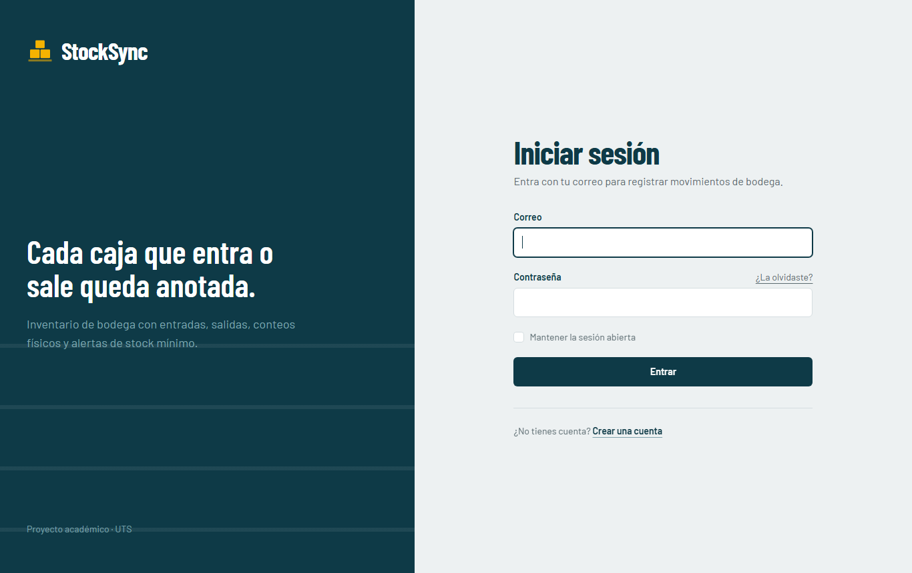

# StockSync – Control de inventario para bodega

**Proyecto académico** (Tecnología en Desarrollo de Sistemas Informáticos, UTS). Es una aplicación web para llevar el inventario de una bodega pequeña: qué productos hay, cuánto stock queda y quién registró cada entrada o salida.

El código se escribió con ayuda de herramientas de IA. Yo definí las reglas del negocio (cómo se mueve el stock, qué se puede borrar y qué no, qué columnas lleva el Excel) y probé que funcionara.

> 🇺🇸 *Academic project: a small warehouse inventory web app built with Laravel. Products by category, stock in/out/adjustments with user and date, low-stock alerts and Excel import/export. Built with AI assistance; I defined the business rules and tested it.*

## Capturas

| Inventario | Registrar movimiento |
|---|---|
|  |  |
| **Historial de movimientos** | **Inicio de sesión** |
|  |  |

El diseño se adapta al celular: el menú lateral pasa a un botón arriba a la derecha.

## Qué hace

- **Productos y categorías:** crear, editar y eliminar productos (SKU, nombre, precio, stock y stock mínimo). Las categorías se crean y se eliminan.
- **Movimientos de stock:**
  - *Entrada:* suma al stock (ej. llegada de proveedor).
  - *Salida:* resta al stock. No deja sacar más de lo que hay.
  - *Ajuste:* después de un conteo físico se escribe la cantidad contada y el stock queda en ese número.
  - Cada movimiento guarda el usuario y la fecha.
- **Alertas de stock bajo:** el panel muestra los productos que están en su stock mínimo o por debajo.
- **Panel principal:** valor del inventario (stock × precio), productos, unidades, lista de productos por reponer con una barra de stock contra el mínimo y últimos movimientos.
- **Búsqueda:** filtra la tabla de inventario por nombre, SKU o categoría.
- **Excel:**
  - *Exportar* descarga el inventario en `.xlsx`.
  - *Importar* (`.xlsx`, `.xls`, `.csv`) crea los SKU nuevos en la categoría elegida y actualiza los que ya existen sin cambiarles la categoría.
- **Usuarios:** registro e inicio de sesión (Laravel Breeze).

### Reglas que protegen los datos
- No se puede borrar una categoría que tiene productos.
- No se puede borrar un producto que ya tiene movimientos (se perdería su historial).
- El stock de un producto no se edita a mano: se cambia con un movimiento, para que quede registrado.
- No se puede eliminar la cuenta de un usuario que ya registró movimientos (el historial perdería al responsable).
- Al importar Excel, si una fila tiene un dato inválido no se guarda nada y se indica qué SKU revisar.

## Lo que todavía no tiene (pendientes)

- El ajuste guarda la cantidad contada, no la diferencia, así que no hay un reporte de mermas.
- Está solo en español.
- No hay roles (todos los usuarios pueden hacer todo) ni lector de código de barras.
- No está publicado en internet; se prueba en local.

## Tecnologías

PHP 8.2, Laravel 12, Blade, Tailwind CSS, Alpine.js, SQLite, Laravel Excel (maatwebsite/excel).

### Diseño

- **Colores:** azul petróleo para la estructura y ámbar de señalización de bodega como acento. El verde se usa solo para entradas y el rojo para salidas.
- **Tipografía:** Barlow y Barlow Condensed (Google Fonts).
- **Etiquetas de SKU:** cada código aparece como la etiqueta amarilla de un estante.
- **Logo:** tres cajas sobre una estiba.

## Cómo probarlo en local

Requisitos: PHP 8.2+, Composer y Node.js.

```bash
git clone https://github.com/santiamm/stocksync-enterprise.git
cd stocksync-enterprise
composer install
npm install
cp .env.example .env        # en Windows: copy .env.example .env
php artisan key:generate
php artisan migrate --seed  # crea la base SQLite y carga datos de ejemplo (si pregunta por crear la base, responde yes)
npm run build
php artisan serve
```

Abre http://127.0.0.1:8000 e inicia sesión con el usuario de prueba:

- **Correo:** `demo@stocksync.test`
- **Contraseña:** `password`

Los correos (por ejemplo, recuperar contraseña) no se envían: quedan escritos en `storage/logs/laravel.log`. Para enviarlos con Gmail hay instrucciones en `.env.example`.

Los datos de ejemplo traen 4 categorías, 15 productos y 6 movimientos. Para volver a empezar: `php artisan migrate:fresh --seed`.

### Pruebas automáticas

```bash
php artisan test
```

Revisan, entre otras cosas, que las salidas no dejen stock negativo, que la importación respete las categorías y que no se borren productos con historial.
